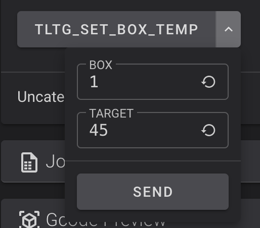

# Qidi Max 4 Optimized

Opinionated and Optimized Klipper macros and slicer machine GCode for the QIDI Max 4.

## tl;dr
1. SSH into your printer `qidi@<your printer's ip>`.
2. Run this on your printer:
```bash
/bin/bash -c "$(curl -fsSL https://github.com/thelegendtubaguy/Qidi-Max-4-Optimized/releases/latest/download/install-latest.sh)"
```
3. Follow the prompts
4. Use Orca and subscribe to the OrcaCloud bundle shared [here](https://cloud.orcaslicer.com/b/4c4b3b74c745).  If you're not using Orca >= 2.4.0, see [the section on slicer configs](#slicer-machine-gcode-updates).
5. Slice using the printer profile `Qidi X-Max 4 0.4 nozzle - TLTG Optimized GCode`
6. Optional: Make a copy and customize the machine profile to your liking.


### Installer Dry-Run
If you'd rather do a dry-run before committing to a full install, you can run this:

```bash
/bin/bash -c "$(curl -fsSL https://github.com/thelegendtubaguy/Qidi-Max-4-Optimized/releases/latest/download/install-latest.sh)" -- --dry-run
```

### Automatic Updates

The installer asks whether to enable hourly automatic optimized config updates before asking whether to restart Klipper. Auto-updates use a system-level systemd timer. Enabling auto-updates requires sudo once to install `/etc/systemd/system/tltg-optimized-auto-update.service` and `/etc/systemd/system/tltg-optimized-auto-update.timer`; the installer uses QIDI's public default sudo password (`qiditech`) unless the environment variable `TLTG_OPTIMIZED_SUDO_PASSWORD` is set, then prompts for a password if the initial sudo attempt fails. 

Each hourly run checks the latest GitHub release checksum, skips while the printer is printing or paused, and then runs the normal installer with preflight checks and auto-approval.

Disable auto-updates:

```bash
~/tltg-optimized-macros/auto-update.sh --disable-systemd
```

Run one auto-update check manually:

```bash
~/tltg-optimized-macros/auto-update.sh --run
```

### QIDI Box temperature from Fluidd

The installer adds `TLTG_SET_BOX_TEMP`, a macro for setting the QIDI Box heater target because Qidi's Fluidd config is incapable of setting `heater_box1` correctly.

Use:

```gcode
TLTG_SET_BOX_TEMP BOX=1 TARGET=45
```

Use `TARGET=0` to turn the box heater off:

```gcode
TLTG_SET_BOX_TEMP BOX=1 TARGET=0
```

The macro appears in Fluidd's Macros panel after install and Klipper restart. If the panel is not visible, edit the Fluidd layout and enable the Macros panel.



### Helpful Klipper tools

After install and Klipper restart, the optimized macro set includes:

```gcode
TLTG_PROBE_ACCURACY_CENTER
TLTG_CORNER_BED_SCREW_CHECK
SCREWS_TILT_CALCULATE
```

`TLTG_PROBE_ACCURACY_CENTER [SAMPLES=20]` homes, moves to `X195 Y195 Z10`, and runs Klipper `PROBE_ACCURACY`.

`TLTG_CORNER_BED_SCREW_CHECK` homes, runs `Z_TILT_ADJUST`, and runs `SCREWS_TILT_CALCULATE`.

### Slicer Machine GCode Updates

> [!TIP]
> If you're using Orca >= 2.4.0, use the OrcaCloud [shared bundle you can subscribe to](https://cloud.orcaslicer.com/b/4c4b3b74c745)!  It will let you get future updates in your slicer easily and you don't have to manually copy/paste anything!

You will need to manually copy the machine GCode to your slicer of choice to take advantage of the optimized path.  The stock print path remains in place for backwards compatibility, safety, and general user happiness :)

Use the pack that matches your slicer. The two packs are functionally aligned, but their placeholder syntax is different due to variable type differences.
   - OrcaSlicer: `orcaslicer_gcode/`
   - QIDI Studio: `qidistudio_gcode/`

Use the pack that matches your slicer. The two packs are functionally aligned, but their placeholder syntax is different.

## Uninstall

If `~/tltg-optimized-macros/` is still present on the printer:

```bash
~/tltg-optimized-macros/install.sh --uninstall --plain
```

You can also run uninstall by fetching the latest script directly from the web:

```bash
/bin/bash -c "$(curl -fsSL https://github.com/thelegendtubaguy/Qidi-Max-4-Optimized/releases/latest/download/install-latest.sh)" -- --uninstall
```

## If something goes wrong

Read the installer output first. The installer stops before writing when firmware detection, preflight, printer state, or free-space checks fail.

Installer-created backup `.zip` files are stored under `/home/qidi/printer_data/` with `tltg-optimized-macros-before-optimize-...zip` and `tltg-optimized-macros-before-uninstall-...zip` labels.

You can restore interactively when SSH'd into the printer.

```bash
cd ~/tltg-optimized-macros && ./restore.sh
```

Restore a specific backup:

```bash
cd ~/tltg-optimized-macros && ./restore.sh --backup /home/qidi/printer_data/<backup-name>.zip
```

If restore completed and the recovery sentinel is still present, clear it with:

```bash
cd ~/tltg-optimized-macros && ./install.sh --clear-recovery-sentinel
```

## Documentation

- [Behavior differences versus stock](docs/current_config_results_vs_stock_qidi_configs.md)
- [QIDI box internals and `BOX_PRINT_START`](docs/box_print_start_notes.md)
- [Want to help with testing?](TESTING.md)

## Development

For development documentation, see [DEVELOPMENT](DEVELOPMENT.md).
